```{r}
library(terra)
library(dplyr)
library(tidyr)
library(ggplot2)
library(knitr)

output_dir <- "outputs_report"
figure_dir <- "report_pngs"

effort_file <- file.path(output_dir, "AARAN_restoration_effort.tif")
cluster_file <- file.path(output_dir, "AARAN_ecosystem_GMM_clusters.tif")
prob_files <- c(
  Low = file.path(output_dir, "AARAN_effort_prob_low.tif"),
  Medium = file.path(output_dir, "AARAN_effort_prob_medium.tif"),
  High = file.path(output_dir, "AARAN_effort_prob_high.tif")
)

effort_labels <- c("Low restoration effort", "Medium restoration effort", "High restoration effort")
effort_cols <- c("#2A9D8F", "#E9C46A", "#E76F51")
mclust_reclass <- data.frame(cluster = 1:3, effort_class = c(2, 1, 3))

effort_raster <- function() {
  if (file.exists(cluster_file)) {
    out <- terra::classify(rast(cluster_file), as.matrix(mclust_reclass))
    levels(out) <- data.frame(ID = 1:3, restoration_effort = effort_labels)
    return(out)
  }
  if (file.exists(effort_file)) return(rast(effort_file))
  NULL
}
```



## Introduction

This report presents the results of land health analysis and assessment of restoration effort to support the prioritisation of land restoration interventions in Somalia for the AARAN project. Restoration effort is assessed using soil and land health indicators, which are clustered into low, medium, and high restoration effort, respectively. The classes are derived from a model-based clustering workflow using five biophysical indicators: tree cover, erosion, root depth restriction at 50 cm, soil pH, and soil organic carbon (SOC).

Throughout the report, restoration effort classes are also interpreted in terms of level of concern for land degradation. Areas classified as high restoration effort correspond to high concern, as they combine indicators associated with active or severe degradation, such as high erosion, low SOC, and unfavourable soil conditions. Conversely, areas of low restoration effort reflect comparatively healthy land and are of low concern. Medium effort areas fall between these extremes. Framing the classes in this way makes clear that the restoration effort gradient is simultaneously a gradient of degradation concern: where intervention needs (effort) are greatest, the underlying land health condition gives greatest cause for concern.

The purpose of the report is to give an overview at country, watershed and cluster level, and to provide a summary of the indicator values associated with each restoration effort class. The report is intended for use by AARAN and other stakeholders to inform restoration planning and prioritization.

::: {.callout-note icon=false}
## Key Findings
- **National Effort Distribution**: Approximately **41%** Medium restoration effort, **38%** Low restoration effort, and **21%** High restoration effort.
- **Biophysical Clustering**: Five indicators (tree cover, erosion, RDR50, soil pH, and SOC) grouped into 3 distinct operational management classes via Gaussian mixture modeling (`mclust`).
- **Primary Predictive Drivers**: Tree cover and soil pH consistently show the highest predictive influence across class-specific Random Forest probability models.
:::

## Methods {#sec-methods}

### Study area and sampling design

The assessment covers the whole of Somalia. To obtain a representative sample of the biophysical indicator values across the country, points were generated at random locations and the values of five indicators were extracted for each point from the raster layers described below. This sampling approach ensures that the full range of environmental conditions present in Somalia is captured, including areas that are remote or otherwise underrepresented in field campaigns.

### Biophysical indicators

The indicators used in this assessment are drawn from the Land Degradation Surveillance Framework (LDSF), a standardized field method developed by ICRAF (CIFOR-ICRAF) for assessing soil and land health. The LDSF has been applied at over 55,000 sampling locations in the tropics over the past two decades, producing one of the largest consistent databases of ground observations on land health. Because the indicators are measured in the same way everywhere, they can be compared across sites and over time, a bit like a standardized health check-up, but for land rather than for people.

A total of about 1,100 sampling locations from 7 LDSF sites in Somalia were also part of the underlying data used to assess soil and land health in AARAN, and to conduct the analysis of restoration effort for the different clusters of the project. These data were collected as part of LDSF surveys in 2024, 2025, and 2026. Soil data was collected from one of these sites (Guriel) and analysed in Nairobi, Kenya.

Five LDSF-based indicators were used, each representing a key aspect of soil and land health:

1. **Tree cover**: the proportion of area covered by woody vegetation, an indicator of vegetation density and habitat provision.
2. **Erosion**: the prevalence or severity of soil erosion, a direct measure of land degradation.
3. **Root depth restriction at 50 cm (RDR50)**: a measure of physical limitations to root development, reflecting soil depth and compaction constraints.
4. **Soil pH**: an indicator of soil chemical conditions, with values far from neutral generally limiting nutrient availability and plant productivity.
5. **Soil organic carbon (SOC)**: a core indicator of soil fertility, water-holding capacity, and carbon storage.

### Model-based clustering

Sampled indicator values were standardized prior to analysis and clustered into three groups using model-based clustering implemented in the `mclust` library in R Statistics. Unlike distance-based methods such as k-means, Gaussian mixture models fit a probabilistic model to the data and assign observations to clusters based on the posterior probability of membership. The number of clusters was set to three to match the operational need for low, medium, and high restoration effort classes.

### Interpreting clusters as restoration effort classes

The three resulting clusters were manually interpreted as restoration effort classes based on the distribution of indicator values in each cluster. The cluster with high erosion, low SOC, and acidic or alkaline pH was classified as high restoration effort (high concern), while the cluster with low erosion, higher SOC, and near-neutral pH was classified as low restoration effort (low concern). The cluster with intermediate indicator values was classified as medium restoration effort (medium concern). Interpretation was supported by the indicator distributions shown in the Results section.

The following considerations were taken into account when interpreting the clusters:

* Areas with low SOC and high erosion are considered to be highly degraded and may require considerable resources and efforts to restore. Hence , active restoration will be required such as the establishment  of soil and water conservation measures (e.g. halfmoons or terracing) combined with tree planting and/or grass re-seeding.
* Alkaline soils (pH> 7.5) can be high in SOC due to high clay content, but may also be challenging to restore when degraded.
* High tree cover in combination with low SOC and high erosion, can indicate invasive species which may require removal.
* High historic SOC concentrations indicate a high potential for carbon storage. Such areas generally also have a higher level of inherent resilience and may require less effort to restore.
* RDR50 maps where roots are physically restricted within the top 0.5 m of soil, indicating reduced access to water and nutrients and therefore lower potential vegetation growth. It helps decide whether to favor shallow‑rooted species, invest in breaking hardpans, or limit expectations for deep‑rooted vegetation in a given area.


### Probability surfaces and variable importance

In order to scale the analysis to the country level, indicator maps were produced by using predictive models that learn the relationship between the LDSF ground observations (stored in a global database of field data from thousands of sites worldwide) and freely available satellite and environmental data, such as climate, terrain, and spectral information. Once a model has "learned" these relationships, it can estimate the indicator values for every location in the country. We produced these maps at a spatial resolution of 250 m for the purpose of this exercise, but more detailed maps can also be generated using this approach. The reliability of this approach rests on the size and quality of the underlying ground truth database, which for the LDSF is the global tropics.

For each restoration effort class, a random forest classification model was developed using the sampled indicator values as predictors of class membership. The models were applied to the full indicator raster stack to produce spatially explicit probability surfaces, expressing for each pixel the probability of belonging to the low, medium, or high restoration effort class. Variable importance measures from the random forest models were used to identify which indicators most strongly distinguish each class, providing insight into the drivers of the observed patterns. Together, the class maps and probability surfaces support spatially explicit prioritization of restoration interventions across Somalia.

## Results
Our analysis shows that SOC is low overall (median SOC below 10 g/kg), but with some sampled locations with SOC higher than 20 g/kg (@fig-indicators_distr_som). Erosion is high overall (median > 60%), tree cover is highly variable, while pH ranges mostly from neutral to alkaline, many parts of the country having pH > 7.5. The Mclust model produced three restoration-effort groups, as described in @sec-methods.

Throughout the report, the restoration effort classes are interpreted in terms of level of concern for land degradation. Areas classified as high restoration effort correspond to high concern, as they combine indicators associated with active or severe degradation, such as high erosion, low SOC, and unfavourable soil conditions (e.g. high pH). Conversely, areas of low restoration effort reflect comparatively healthy land and are of low concern, while medium effort areas fall between these extremes. The restoration effort gradient is therefore simultaneously a gradient of degradation concern: where intervention needs (effort) are greatest, the underlying land health condition gives the greatest cause for concern.

Areas of high concern have high levels of land degradation (erosion) and low SOC, often in combination with sparse tree cover and alkaline soils. These are the locations where restoration interventions will require the greatest investment, but also where the expected gains in land health and productivity are likely to be largest. Areas of low concern largely coincide with regions of higher tree cover and SOC, and can serve as reference or benchmark areas for restoration elsewhere in the country. Medium concern areas are transitional: they are generally still productive but show early warning signs of degradation, and are where relatively low-cost interventions may prevent further decline.

{#fig-indicators_distr_som}

As we see in @fig-indicators_distr_som, areas with high concern in terms of land degradation have high erosion (the red density graph is skewed to the right) while areas with low concern have low erosion (the blue density graph is skewed to the left). If we look at pH, we see that areas with high concern have high pH, while these areas have very low SOC (the blue density graph is skewed to the left in the SOC panel in @fig-indicators_distr_som). For tree cover (bottom panel), the picture is a bit more mixed, but areas with high concern generally have very low tree cover.These groups provide the main classification used in the report, which we use to classify restoration effort within and across AARAN clusters.

## Random Forest Results

A random forest model was used to predict low, medium, and high restoration effort. It produces a class-specific probability surface for each class, and variable importance is assessed with class-specific (one-vs-rest) models to show which indicators contribute most to each class prediction.

### Variable importance

Variable importance measures show how useful each indicator is for predicting a given restoration effort class. Random forests work by repeatedly splitting the data on the indicator values; at each split, an indicator that cleanly separates the classes reduces the uncertainty ("impurity") of the classification. Importance is calculated as the total reduction in impurity achieved by each indicator across all splits in the model: the larger the reduction, the more the model relies on that indicator. The graphs in @fig-importance show this importance for each class, with longer bars indicating indicators that contribute more to the class prediction.

The results indicate that SOC is a strong predictor of high restoration effort, reflecting the distribution of SOC values in @fig-indicators_distr_som where we see a strong separation of SOC values between high and medium/low effort areas. Erosion is high overall with overlapping distributions in @fig-indicators_distr_som.

{#fig-importance}

## Country-Level Overview

At country level, the restoration-effort map shows the spatial distribution of low, medium, and high effort areas. The area graph summarizes how many square kilometers fall within each effort class.

```{r}
#| label: fig-country-restoration-effort-map
#| fig-cap: "Restoration effort classes across Somalia."
effort <- effort_raster()

if (!is.null(effort)) {
  plot(effort, col = effort_cols, main = "Somalia Restoration Effort")
} else {
  cat("Attach or generate the country restoration-effort map raster at: ", cluster_file)
}
```

```{r}
#| label: fig-country-restoration-effort-area
#| fig-cap: "Area of Somalia under low, medium, and high restoration effort."
effort <- effort_raster()

if (!is.null(effort)) {
  area_df <- as.data.frame(c(effort, cellSize(effort, unit = "km")), na.rm = TRUE)
  names(area_df) <- c("effort_class", "area_km2")

  area_summary <- area_df |>
    group_by(effort_class) |>
    summarise(area_km2 = sum(area_km2), .groups = "drop") |>
    mutate(restoration_effort = factor(effort_labels[effort_class], effort_labels))

  ggplot(area_summary, aes(restoration_effort, area_km2, fill = restoration_effort)) +
    geom_col(width = 0.65) +
    scale_fill_manual(values = effort_cols) +
    labs(x = "Restoration effort class", y = "Area (km2)", fill = NULL) +
    theme_minimal() +
    theme(legend.position = "none")
} else {
  cat("Attach or generate the country restoration-effort raster at: ", cluster_file)
}
```

```{r}
if (exists("area_summary")) {
  kable(area_summary, digits = 2)
}
```

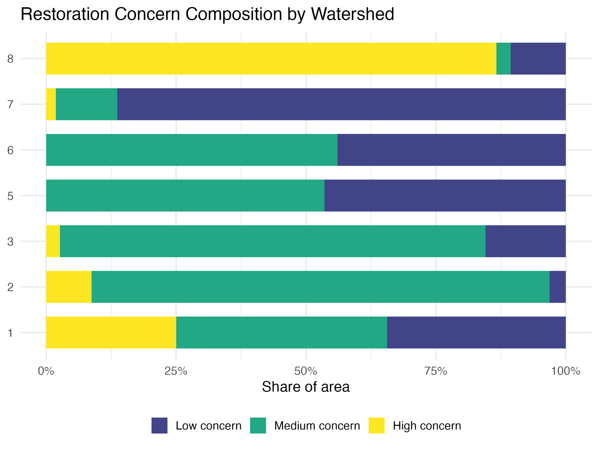{#fig-watershed-concern-composition}

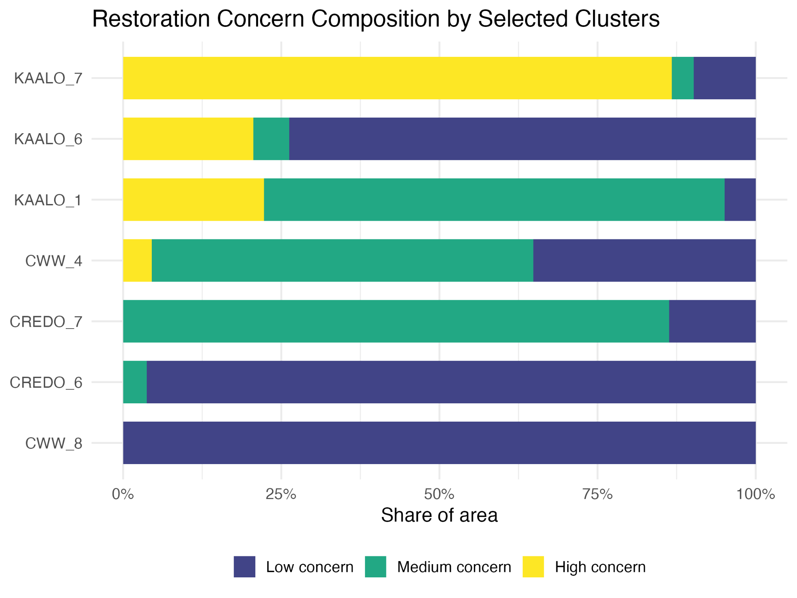{#fig-cluster-concern-composition}

## Watershed and Cluster-Level Analysis

Degradation levels vary considerably between the project clusters, and therefore the level of restoration concern and the recommended restoration practices also vary by cluster. The distribution of the three concern classes across watersheds shows that Watershed 8 in the Nugaal region has the highest percentage of area under high concern, while Watersheds 5 and 6 in Bay region have little to no area under high concern.

At cluster level, `KAALO_7` in Nugaal has the highest percentage of area under high concern. `GREDO_7` and `GREDO_6` in Bay have very limited high concern area, while `CWW_8` in Gedo is entirely under low concern. The analysis can therefore be broken down by watershed and by the cluster contained within each watershed.

### Watershed 1 and KAALO_6

Watershed 1 contains the `KAALO_6` cluster. Indicator distributions compare country and watershed medians, while the cluster summary compares country, watershed and cluster medians. Under the high concern class, erosion and pH distributions are shifted toward higher values, indicating more severe erosion and less favourable pH conditions. In contrast, SOC, RDR50 and tree cover are shifted toward lower values, reflecting reduced soil carbon, shallower effective rooting depth and sparser vegetation in high concern areas.

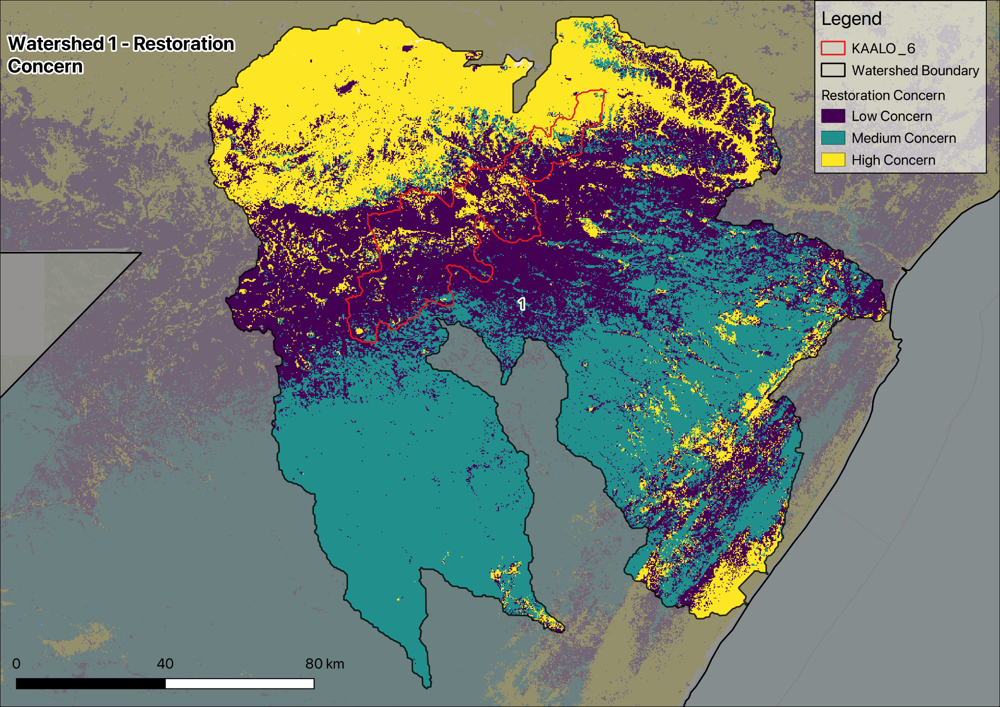{#fig-watershed-1-map}

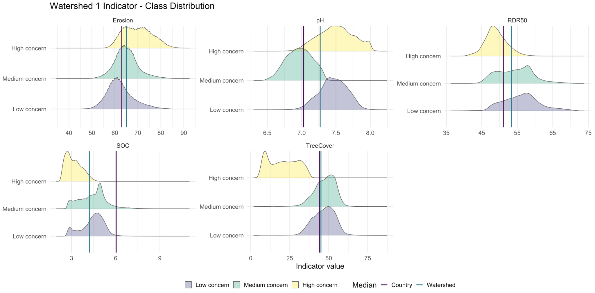{#fig-watershed-1-distribution}

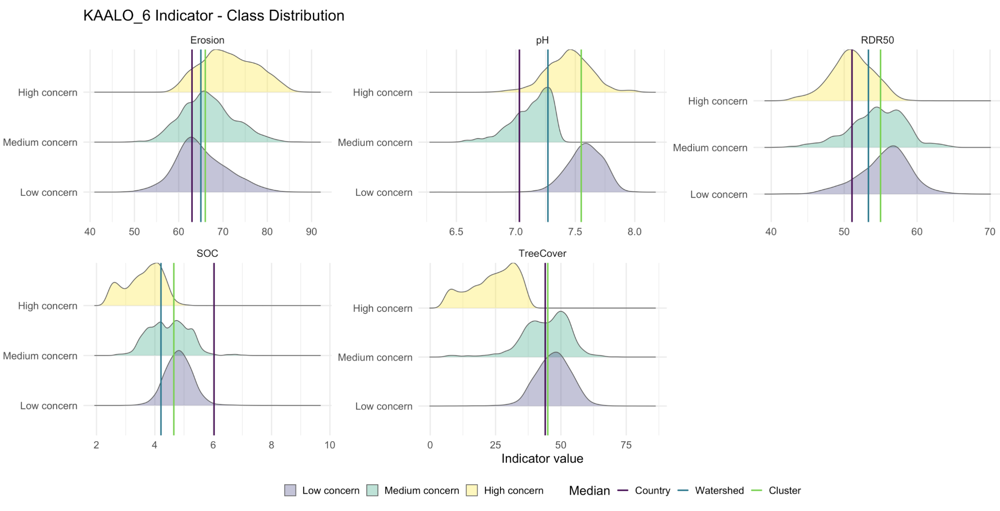{#fig-kaalo-6-distribution}

Across high concern indicators, the watershed median is generally higher than the national median, except for SOC, where the watershed median is lower. This suggests that, relative to the country, Watershed 1 experiences more intense erosion, more extreme pH and greater root-depth restriction, with lower soil organic carbon but higher tree cover. Across indicators, the `KAALO_6` median is generally higher than the national and watershed medians, except for SOC, where it is lower than the country median but higher than the watershed median.

### Watershed 2 and KAALO_1

Watershed 2 contains the `KAALO_1` cluster. Across high concern indicators, the watershed median is generally lower than the national median. This suggests that, relative to the country, the watershed has relatively lower pH and root-depth restriction, higher soil organic carbon and higher tree cover, while erosion remains an important pressure.

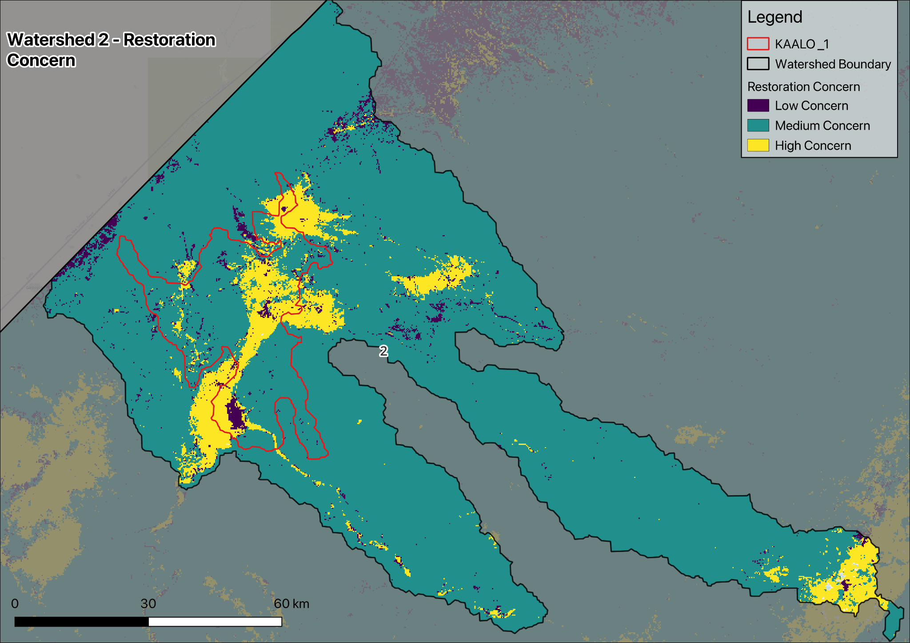{#fig-watershed-2-map}

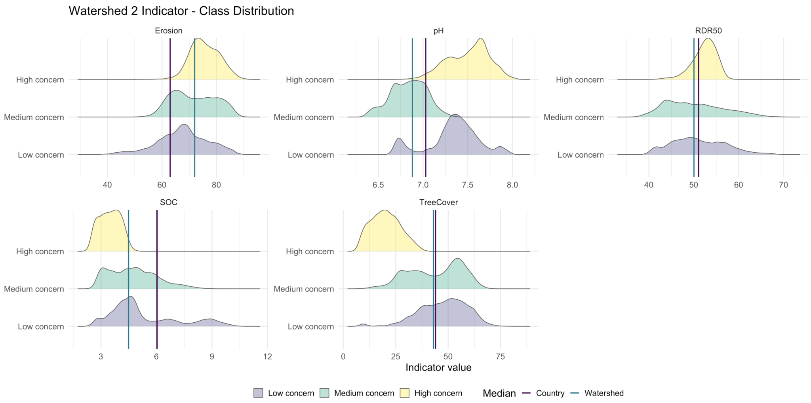{#fig-watershed-2-distribution}

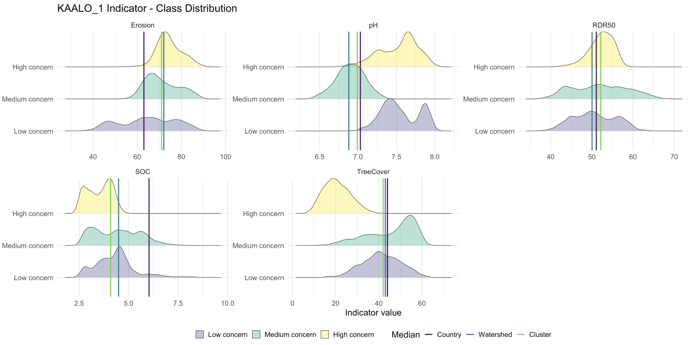{#fig-kaalo-1-distribution}

Across indicators, the `KAALO_1` median generally lies between the country and watershed medians for erosion, is higher than both for root depth restriction, and lower for SOC and tree cover. This pattern suggests that `KAALO_1` experiences intermediate erosion pressure but more severe physical rooting constraints than either the broader watershed or the country average. Lower SOC and tree cover imply weaker vegetation structure and reduced carbon storage, pointing to conditions that may be more vulnerable to further decline unless restoration specifically targets vegetation recovery and SOC accumulation.

### Watershed 3 and CWW_4

Watershed 3 contains the `CWW_4` cluster. Across high concern indicators, the watershed median is generally lower than the national median, except for erosion and tree cover, where the watershed median is higher. This indicates that the watershed experiences stronger erosion pressure and higher tree cover, but relatively lower pH, lower root-depth restriction and higher soil organic carbon compared with the national scale.

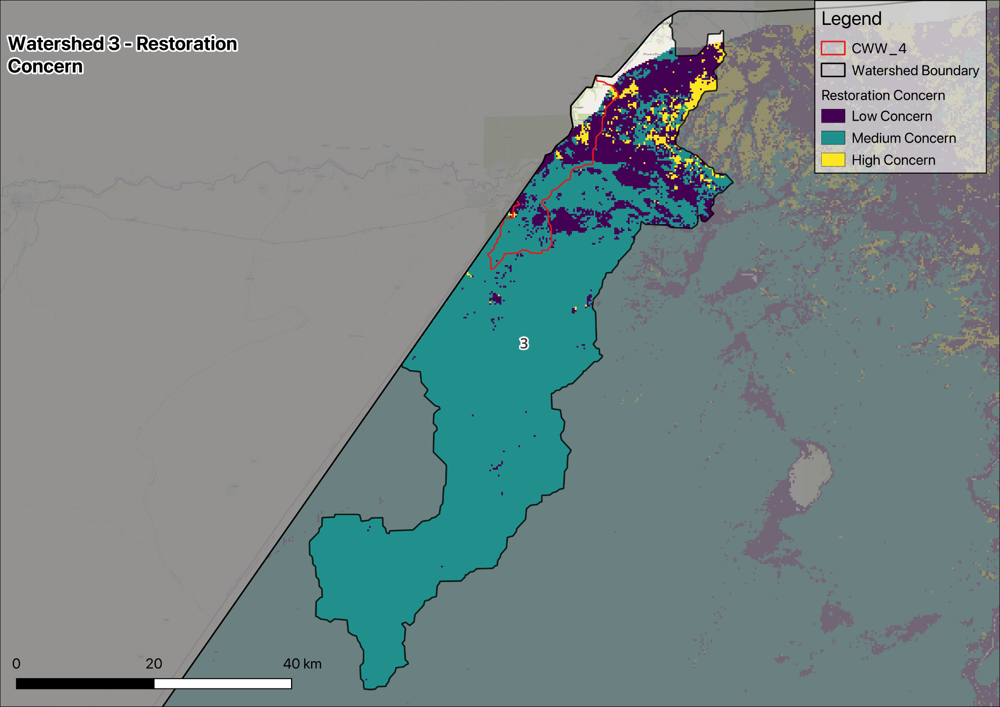{#fig-watershed-3-map}

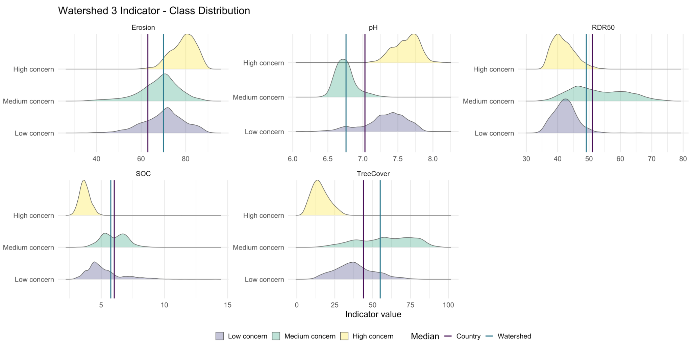{#fig-watershed-3-distribution}

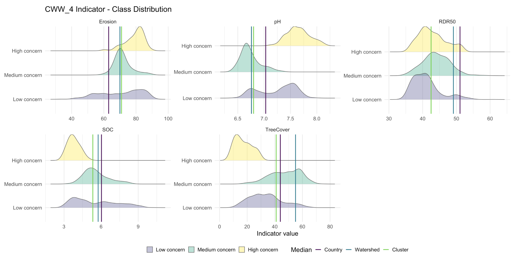{#fig-cww-4-distribution}

Across indicators, the `CWW_4` median is lower than the country and watershed medians for root depth restriction, SOC and tree cover, but higher than both for erosion and intermediate for pH. These results suggest that the cluster faces stronger erosion pressure, more severe root-depth restriction, and reduced vegetation and SOC relative to the country and watershed scales, while experiencing intermediate pH conditions.

### Watersheds 5 and 6 with GREDO_6 and GREDO_7

Watersheds 5 and 6 contain the `GREDO_6` and `GREDO_7` clusters. No areas in these watersheds meet the high-concern class; conditions are dominated by medium concern followed by low concern. This is consistent with landscapes where severe degradation is limited and most areas fall into moderate or better condition classes.

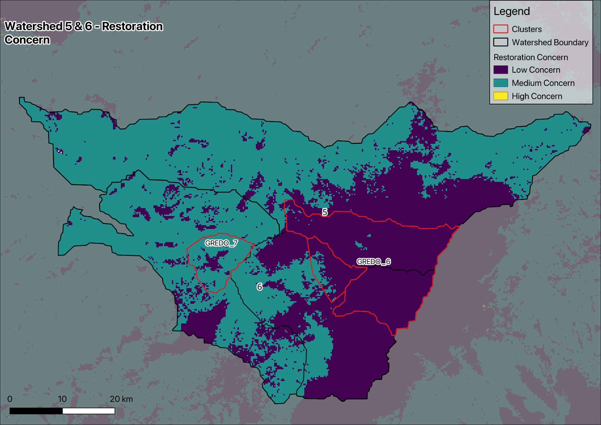{#fig-watershed-5-6-map}

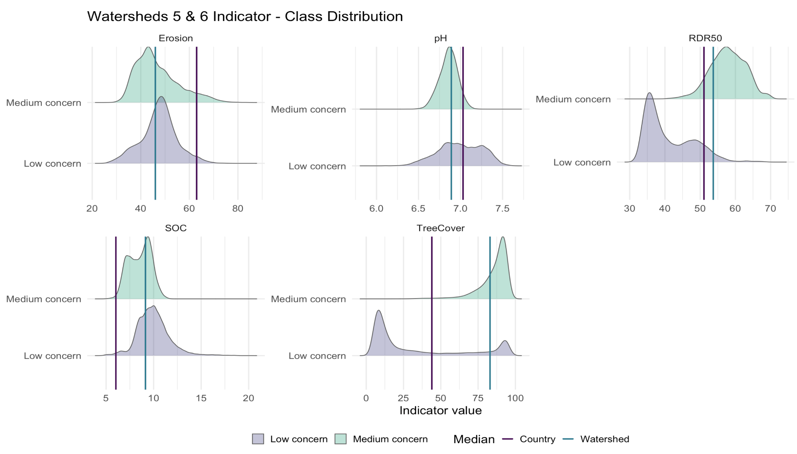{#fig-watershed-5-6-distribution}

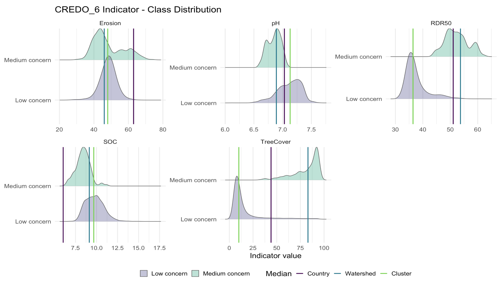{#fig-gredo-6-distribution}

For `GREDO_6`, the median is lower than the country and watershed medians for root depth restriction and tree cover, but higher than both for pH and SOC. Erosion is intermediate, with the country erosion median higher than the cluster median. This suggests shallower effective rooting depth and more sparse tree cover than the broader regions, but more favourable pH, higher SOC and lower erosion compared with the national scale.

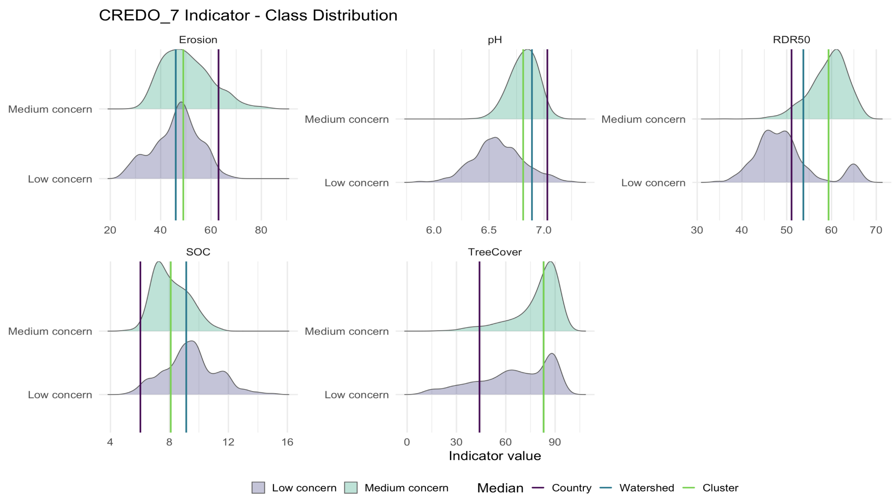{#fig-gredo-7-distribution}

For `GREDO_7`, the median is lower than the country and watershed medians for pH, higher than both for root depth restriction and tree cover, and intermediate for erosion and SOC. This suggests less favourable pH conditions but deeper effective rooting depth and denser tree cover than both broader scales. Erosion pressure is moderately lower than the country median but slightly above the watershed median, while SOC is better than the country overall but not as high as the watershed median.

### Watershed 7 and CWW_8

Watershed 7 contains the `CWW_8` cluster. Across high concern indicators, the watershed median is generally lower than the country median, except for SOC and pH, where the watershed median is higher. This suggests that the watershed has higher soil organic carbon and slightly higher pH in high concern areas, while erosion, root depth restriction and tree cover tend to be lower.

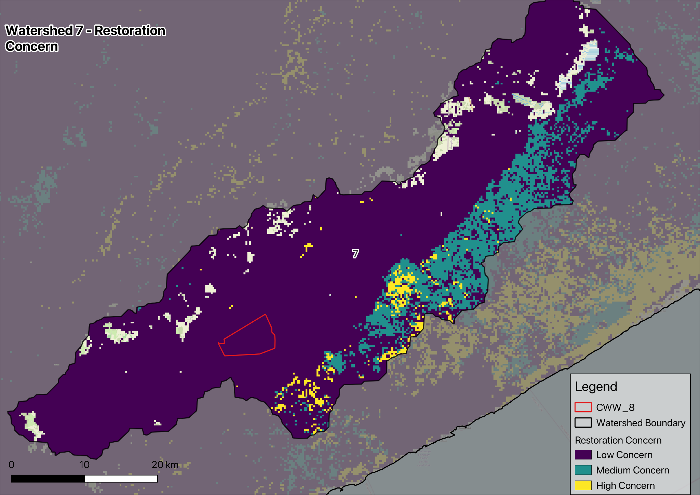{#fig-watershed-7-map}

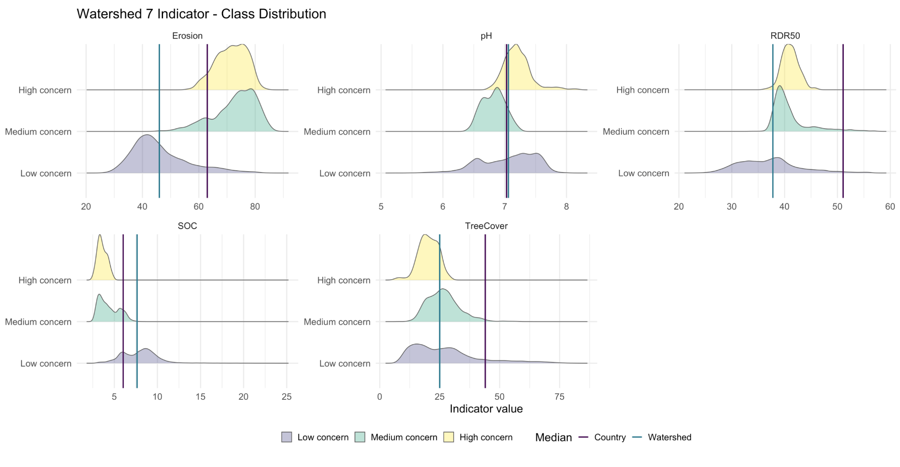{#fig-watershed-7-distribution}

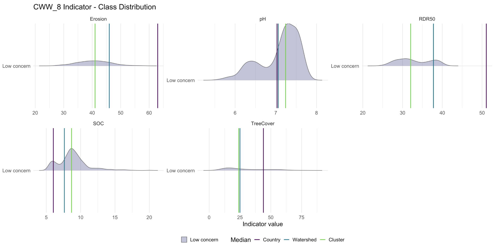{#fig-cww-8-distribution}

Across indicators, the `CWW_8` median is lower than the country and watershed medians for erosion and root depth restriction, but higher for pH and SOC, and lower for tree cover. The cluster falls entirely within the low-concern class, so restoration efforts should focus on conservation and enhancing vegetation cover to maintain and improve existing conditions.

### Watershed 8 and KAALO_7

Watershed 8 contains the `KAALO_7` cluster. The watershed and cluster are dominated by high concern. Across high concern indicators, the watershed median is generally lower than the national median, except for erosion and pH, where the watershed median is higher. This suggests that, relative to the country, the watershed experiences more intense degradation across key indicators.

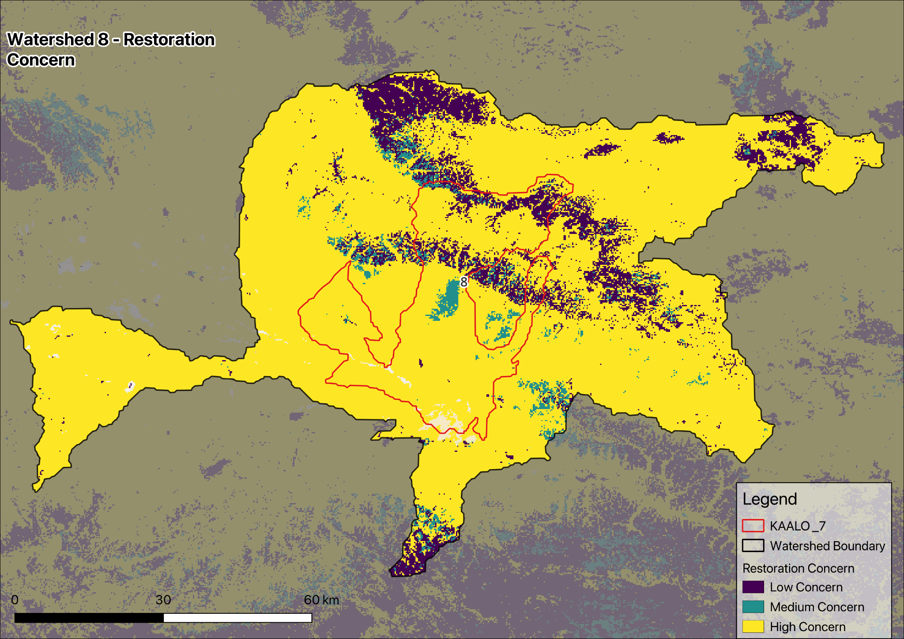{#fig-watershed-8-map}

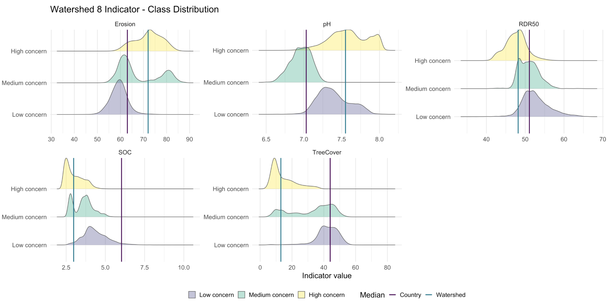{#fig-watershed-8-distribution}

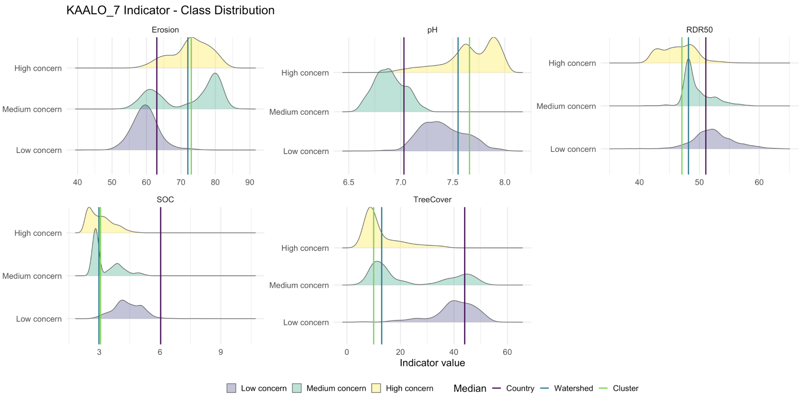{#fig-kaalo-7-distribution}

For `KAALO_7`, the pattern closely matches its parent watershed. The median is lower than the national median for root depth restriction and tree cover, close to the watershed median for SOC, and higher for pH and erosion. This indicates that the cluster is generally more degraded than the broader national scale. Restoration efforts in `KAALO_7` should prioritize erosion control, soil conservation and increasing vegetation cover through interventions such as contour bunds, mulching and improved grazing management. Limited effective rooting depth may hinder the establishment of deep-rooted species; where feasible, soil decompaction could be considered before planting, or shallow-rooted, stress-tolerant species should be prioritized.

## Restoration Recommendations

**Low concern areas** generally exhibit favourable ecosystem conditions, including high tree cover, moderate SOC, nearly neutral pH and relatively high RDR50 values. Intensive restoration is unlikely to be required, although moderate to high erosion levels indicate that soil and water conservation measures could help prevent further degradation. Restoration should focus on protection, maintenance and erosion control while preserving existing vegetation.

**Medium concern areas** exhibit mixed ecosystem conditions, characterized by moderate tree cover, relatively high SOC, slightly alkaline soils and intermediate root-depth restriction. The comparatively favourable soil conditions suggest that vegetation restoration remains feasible. Targeted tree planting, grass reseeding and improved grazing management may be appropriate where vegetation cover is declining or sparse. Localized soil and water conservation measures should also be considered, particularly in areas experiencing moderate or high erosion.

**High concern areas** show the strongest indicators of degradation, including very low tree cover, high erosion, very low SOC, alkaline soil conditions and relatively low RDR50 values. Restoration will likely require more active, sustained and resource-intensive intervention. Soil and water conservation measures such as halfmoons, contour bunds and terraces should be prioritized to reduce erosion and improve water retention before or alongside vegetation restoration. In severely eroded locations, physical structures such as check dams or gabions may also be needed to stabilize channels and control sediment movement. Grass reseeding and targeted tree establishment can help increase vegetation cover and gradually rebuild SOC.

## Conclusion

The output shows that about 41% of Somalia is classified as medium restoration effort, 38% as low, and 21% as high. The variable importance graphs indicate that tree cover and pH are the most influential indicators for predicting restoration effort classes. These results can inform restoration planning and prioritization across Somalia.
